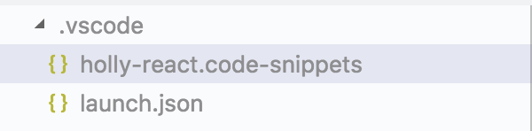
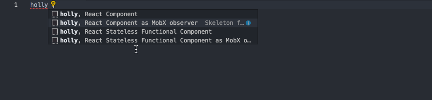
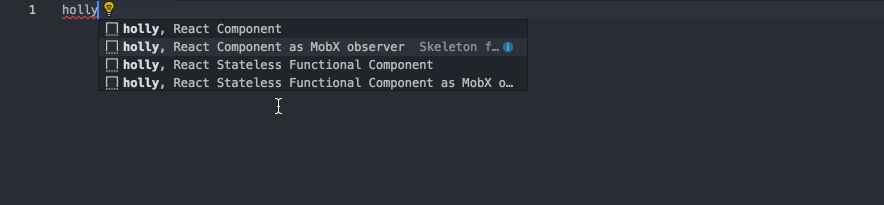
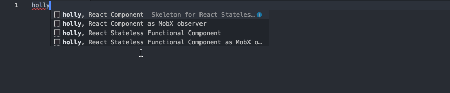

# vscode-snippets

Few basic snippets for FE development on Holly react projects.

## How to install snippets

1. Checkout snippets project
2. Copy file *snippets/holly-react.snippets* into *.vscode/* directory.

## Hot to use snippets
Following snippets are ready:

### React Stateless Functional Component as MobX observer

### React Stateless Functional Component

### React Component as MobX observer

### React Component

## How to create own snippets
See [official documentation](https://code.visualstudio.com/docs/editor/userdefinedsnippets) for more details.

